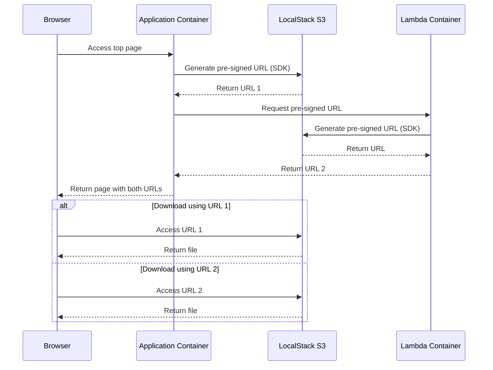

# sample-localstack-hoststyle
A sample architecture using LocalStack as its local development environment which never uses "path style" S3 URL.

## Prerequisites
- Docker (including Docker Compose)
- Go
- make (NOTE: alternatively, you can do the same commands in the Makefile)

## Overview

This application demonstrates how to generate and use pre-signed URLs for S3 objects in a local development environment using LocalStack. The URLs are generated both from the application container and Lambda function running in LocalStack.

## Author
tenkoh

## License
MIT
